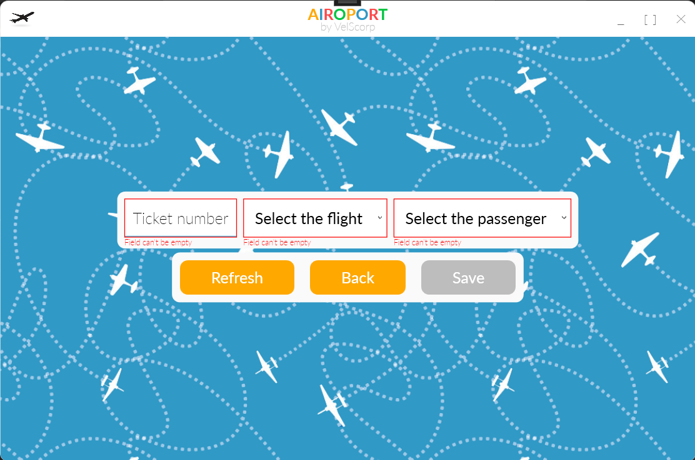

# AIS_Airport

AIS_Airport is a C# application designed to manage airport information systems efficiently. This project provides functionalities for managing flights, passengers, and various airport operations, offering a comprehensive solution for airport administration and management.

## Features

### Ticket Management
- **Create New Ticket:** Create new ticket with detailed information including ticket number, flight number, passenger info.
- **Update Flight Details:** Modify existing ticket information as needed.
- **View Ticket Information:** Access detailed information about all tickets.
- **Filter Ticket Information:** Filter tickets by date.
- **Sort Ticket Information:** Sort tickets by number, by start date.
- **Generate word document:** Generate word document with all ticket information ready for print.

### Flight Management
- **Add New Airline:** Create new airline with detailed information including title, contacts, head office address.
- **Add New Airplane:** Create new airplane with detailed information including board number, model, capacity, departure date.
- **Add New Destination:** Create new destination with detailed information including title, address, coordinates.
- **Add New Flights:** Create and schedule new flights with detailed information including flight number, destination, departure date and time.
- **View Flight Information:** Access detailed information about all scheduled flights.
- **Filter Flight Information:** Filter flights by date.
- **Sort Flight Information:** Sort flights by number, by ticket price, by start date.

### Passenger Management
- **Register New Passengers:** Add new passengers to the system with their personal details.
- **Add New Discount:** Add new discount to the system with discount percentage.
- **Update Passenger Information:** Modify existing passenger information.
- **View Passenger List:** Access a list of all registered passengers.

### Statistic Information
- **Statistic:** Provides statistical information such as Profit by destination, Average ticket prices, Count of flight by destinations.

### Stuff Management
- **Register New Employee:** Add new employees to the system with their personal details and their position.
- **Add New Position:** Add new position to the system with the different rights such as Right to sell tickets or Right to add new employees.

### DataBase Security
- **Security:** Passwords are protected and stored in a SQLite 3 database using the custom MD5 algorithm..

## Screenshots

### Sign In


### Main Menu


### Ticket Selling


### Create new and Change this Ticket


### Flights list


### Add new Flight


### Passengers


### Create new and Change selected Passenger


### Statistics


### Add new employee


## Usage

1. **Clone the repository:**

```bash
git clone https://github.com/VelSkorp/AIS_Airport.git
```

2. Navigate to the project directory:

```bash
cd AIS_Airoport
```

3. Open the project in your preferred IDE (e.g., Visual Studio).

4. Build and run the application:
	- In Visual Studio, click on Build > Build Solution.
	- Once the build is complete, click on Debug > Start Debugging.
	- Sing In into application (default username `admin` with password `admin`)

## Contributing

Contributions to SimpleGraphics are welcome! If you find any issues or have ideas for improvements, feel free to open an issue or submit a pull request on GitHub.

## License

This project is licensed under the MIT License - see the [LICENSE](LICENSE) file for details.